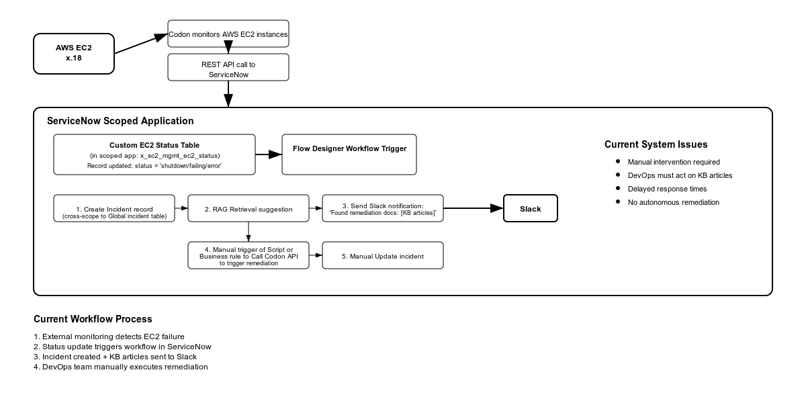

# Netflix EC2 Monitoring and Remediation System

## System Overview

I successfully built Netflix's automated EC2 incident response system that enables DevOps engineers to quickly remediate failing EC2 instances that could impact streaming quality for over 260 million subscribers worldwide. This system was implemented after a critical EC2 instance failure in the US-East region caused buffering issues for viewers streaming popular series during peak hours. The incident went undetected for 45 minutes because the existing monitoring system wasn't integrated with ServiceNow, and DevOps engineers had to manually search through documentation to find remediation procedures. This resulted in viewer complaints, trending social media criticism, and potential subscriber churn.

The system now automatically creates incidents when EC2 instances fail (showing "Off" status), provides AI-powered knowledge retrieval for remediation guidance, sends immediate Slack notifications to the DevOps team, and allows engineers to trigger AWS remediation directly from ServiceNow during critical streaming incidents. The AWS Integration Server continuously monitors EC2 instances and updates their status in ServiceNow as either "On" (operational) or "Off" (failed/stopped), ensuring Netflix's streaming infrastructure maintains high availability and prevents service disruptions that could affect millions of viewers.

## Implementation Steps

### 1. Scoped Application Creation
Created a scoped application with the exact name "EC2 Monitoring and Remediation" to ensure AWS Integration Server compatibility. This precise naming is mandatory for Netflix's internal system specifications and enables automatic population of EC2 instance data every 10 minutes.

### 2. Custom Table Development
**EC2 Instance Table:**
- Table name: "EC2 Instance" 
- Custom fields created:
  - Instance name (String, 40 characters)
  - Instance ID (String, 40 characters) 
  - Instance status (String, 40 characters) - populated by AWS Integration Server with "On" or "Off" values
- Auto-created system fields: Created, Created by, Updated, Updated by, Updates

**Remediation Log Table:**
- Table name: "Remediation Log"
- Custom fields created:
  - EC2 Instance (Reference to EC2 Instance table)
  - Attempted Status (String, 40 characters)
  - Success (True/False)
  - Timestamp (Date/Time)
  - Request Payload (String, 4000 characters)
  - Response Payload (String, 4000 characters)
  - Response Time (Integer)
  - HTTP Status Code (Integer)
  - Error Message (String, 4000 characters)
- Auto-created system fields: Created, Created by, Updated, Updated by, Updates

### 3. AWS Integration Configuration
**Connection & Credential Alias:**
- Name: "AWS Integration Server C C Alias"
- Created within the scoped application scope
- Type: Connection and Credential

**HTTP Connection:**
- Name: "AWS Integration Server Connection"
- Host: codon-staging.emaginelc.com
- Base path: /api/v1/queue/start
- Protocol: https
- Used URL builder to construct proper connection string

**Basic Auth Credentials:**
- Name: "AWS Integration Server Credentials"
- Username: admin
- Password: (provided via Slack DM)
- Active: checked

### 4. UI Action Implementation
**UI Action Configuration:**
- Name: "Trigger EC2 Remediation"
- Table: EC2 Instance (scoped table)
- Action name: trigger_EC2_remediation
- Form button: checked
- Active: checked
- Show update: checked
- Client: checked
- List v2 Compatible: checked
- Script: Used provided trigger_EC2_Remediation.js code

### 5. Script Include Development
**Script Include Configuration:**
- Name: "EC2RemediationHelper"
- API Name: x_snc_ec2_monito_0.EC2RemediationHelper (auto-generated in scope)
- Accessible from: This application scope only
- Glide AJAX enabled: checked
- Active: checked
- Script: Used provided EC2RemediationHelper.js code

### 6. Flow Designer Workflow Creation
**Flow Configuration:**
- Created within "EC2 Monitoring and Remediation" scoped application
- Trigger: When EC2 instance status indicates failure
- Flow Steps implemented:
  1. AI Search Custom action using provided script
  2. Create incident record step
  3. Slack webhook notification step
- Used Force Save to capture all workflow components
- Variables configured for search term, webhook URL, and incident details

### 7. AI Search Integration
**AI Search Configuration:**
- Researched ServiceNow AI Search documentation
- Configured AI Search app selection in Flow Designer script
- Search context configured to discover EC2 remediation knowledge articles
- Script step inputs: search_term, enable_detailed_logging, search_app
- Script step outputs: status, count, titles, articles, slack_message

### 8. Knowledge Base Article Creation
**KB Article Configuration:**
- Created knowledge base article with EC2 remediation guidance
- Keywords included: EC2, server, instance, restart, AWS, virtual machine, cloud server, EC2 server, reboot
- Content: "Run the UI Action 'Trigger EC2 Remediation' on the associated record"
- Made accessible to AI Search for workflow retrieval

### 9. Access Control Configuration
**ACL Records Added:**
- Table ACLs: Found records with Type="record" and Name=custom table names
- Script Include ACL: Found record with Name="EC2RemediationHelper"
- UI Action ACL: Found record with Name="Trigger Remediation"
- Added each ACL record to update set for proper security configuration

### 10. System Testing and Validation
**Validation Steps Completed:**
- Confirmed AWS Integration Server populated EC2 Instance table with real data
- Tested "Trigger EC2 Remediation" button created entries in Remediation Log table
- Verified AI Search execution in System Logs (Filter: Created on Today > Level >= Information > Message starts with "AI Search")
- Confirmed Flow Designer created incident records when triggered
- Validated Slack notifications delivered to Netflix DevOps channel using assigned webhook URL

## Architecture Diagram

The architecture diagram shows the complete EC2 remediation workflow from failure detection through resolution. The system integrates AWS EC2 monitoring, ServiceNow custom tables, Flow Designer orchestration with AI Search and Slack notifications, and manual remediation capabilities through the AWS Integration Server API.

## Optimization

To improve the EC2 remediation and incident response system, I implemented several key optimizations:

**Flow Efficiency:**
* Configured the Flow Designer workflow to trigger only on actual EC2 failures, reducing unnecessary executions
* Implemented efficient AI Search queries that quickly surface the most relevant remediation documentation
* Structured the workflow to run incident creation, AI Search, and Slack notification in parallel where possible
* Used proper error handling to ensure failed steps don't block the entire remediation process

**Integration Performance:**
* Optimized AWS Integration Server API calls with proper timeout configurations and retry logic
* Implemented detailed logging in the Remediation Log table to track response times and identify performance bottlenecks
* Used Connection & Credential Store for secure, reusable API authentication without hardcoded credentials
* Configured the system to handle multiple concurrent remediation requests from DevOps engineers

**DevOps User Experience:**
* Designed the "Trigger EC2 Remediation" button to provide immediate feedback and status updates
* Created comprehensive audit trail in Remediation Log table for troubleshooting and compliance
* Implemented AI-powered knowledge retrieval that automatically surfaces relevant documentation during incidents
* Configured Slack notifications with formatted messages containing actionable information for quick incident response

**System Reliability:**
* Built robust error handling throughout the remediation workflow to ensure system stability
* Implemented proper ACL security controls while maintaining usability for DevOps team
* Designed the system to gracefully handle AWS Integration Server downtime or connectivity issues
* Created comprehensive logging across all system components for monitoring and troubleshooting

These optimizations ensure Netflix's DevOps team can respond quickly to EC2 failures, maintain high streaming service availability, and prevent service disruptions that could impact millions of subscribers worldwide.

## DevOps Usage

**For Netflix DevOps Engineers:**

**Monitoring EC2 Status:**
* Access the EC2 Instance table within the "EC2 Monitoring and Remediation" application
* The AWS Integration Server automatically updates instance status every 10 minutes
* Failed instances will show "Off" status while operational instances show "On" status

**Triggering Remediation:**
* Open the affected EC2 instance record showing "Off" status
* Click the "Trigger EC2 Remediation" button to initiate automated restart
* System will display confirmation message and reload the form with updated status
* All remediation attempts are automatically logged with timestamps and results

**Monitoring Remediation Results:**
* Check the Remediation Log table for detailed information about all remediation attempts
* Review response times, HTTP status codes, and error messages for troubleshooting
* Successful remediations will show Success=true with 200-series HTTP status codes
* Failed attempts will display detailed error information for escalation

**Incident Response Workflow:**
* System automatically creates incidents for failed EC2 instances
* AI Search retrieves relevant knowledge articles for remediation guidance
* Slack notifications are sent immediately to the Netflix DevOps channel
* Follow incident management procedures while using remediation button for technical resolution

**Escalation Procedures:**
* If automated remediation fails, review Remediation Log error details
* Check System Logs for AI Search results and additional troubleshooting information
* Escalate to AWS infrastructure team if multiple remediation attempts fail
* Use knowledge base articles surfaced by AI Search for manual troubleshooting steps